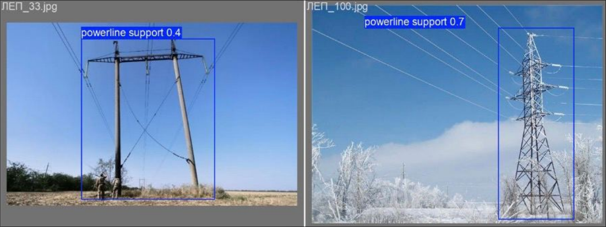

# 'AI For Defense' Summer Shool Hackathon Solution
Autonomous drone navigation using electrical supply line tracking.  


## Installation
Prerequisites:
* Python 3.12.3 *(Should probably work fine on 3.11+)*
* Latest pip version
* Gazebo Classic 11.14.0
* QGroundControl 4.3.0
* Latest PX4 software 

To install the program, follow the next steps
1. Ensure you have installed everything listed above
2. Clone the repository and cd into it
    ```
    git clone https://github.com/n1n1n1q/ai_for_def-hackathon/
    cd ai_for_def-hackathon
    ```
3. Install Python dependencies
    ```
    pip install -r requirements.txt
    ```
4. Clone and run the PX4 software with Gazebo simulator
    ```
    cd ..
    git clone https://github.com/PX4/PX4-Autopilot
    cd PX4-Autopilot
    make px4_sitl gazebo
    ```
5. Run QGC and connect with the simulator
6. Run Python script
    ```
    cd ..
    cd ai_for_def-hackathon
    python src/main.py
    ```

## Roadmap
More approximate goals: 
* Gather more data / generate own data either in ultra realistic game engines in different weather conditions or using generative AI
* Train the model with more appropriate data (top view, wires, various angles etc) to achieve better prediction accuracy
* Look into other object-detection algorithms and compare their performance (computational resources usage / speed)

Long-term goals:
* Optimize for stacks with low computational resources
* IRL implementation & tests
* Implement solution for tracking other elongated objects (rivers, pipes etc)
* Implement map pings when detecting a defect 

## Credits & Responsibilities
### Credits
Took huge inspiration as well as dataset from [this repository](https://github.com/r3ab/ttpla_dataset?tab=readme-ov-file)
### Responsibilities
Eugene Kravchuk - 3D modelling & simulation  
Maksym Dzoban - Data engineer  
Anna Stasyshyn - ML engineer  
Oleh Basystyi - Middleware engineer